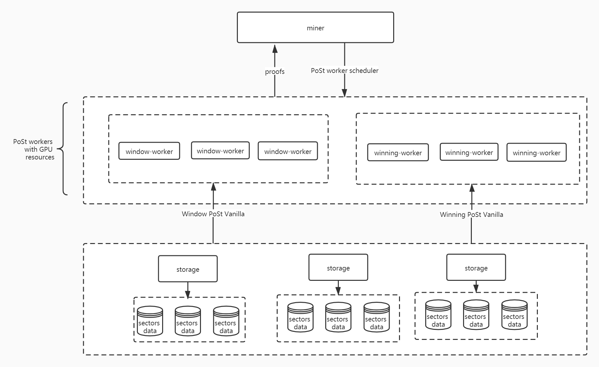

## Decoupling WinningPoSt and WindowPoSt from lotus-miner


## Design summary



- Miner gets sector storage info and sector path for PoSt worker.
- PoSt worker gets VanillaPoSt by HTTP from remote workers.
- Miner schedules window PoSt workers to calculate WindowPost in parallel for batch. 
- Miner schedules PoSt workers based on GPU . 
- Multiple window workers can be deployed according to the size of the cluster.


## Detailed design

### Add interface

- Add filecoin-ffi interface

```
// Sorting and de-duplication sector info
func DeDuplicatePrivateSectorInfo(ctx context.Context, privsectors *SortedPrivateSectorInfo) (SortedPrivateSectorInfo, error)

// Get sector info from start to end
func SplitSortedPrivateSectorInfo(ctx context.Context, privsectors SortedPrivateSectorInfo, start int, end int) (SortedPrivateSectorInfo, error)

// Get the number of sectors that need to be certified for each partition of the window
func GetPartitionSectorCount(ctx context.Context, proofType int, repslen int) (int, error)

// Get vanilla PoSt params of partition
func GetPartitionVanillaParams(ctx context.Context,proofType abi.RegisteredPoStProof,sectorsLen uint64,) (partitionVanillaParams string, err error)

// Get vanilla PoSt params of sector
func GetSectorVanillaParams(ctx context.Context, offset int, partitionVanillaParams string) （sectorVanillaParams string, err error)

// Generate window vanilla PoSt for the given sectors which compose a partition
func GenerateWindowPoStVanilla(ctx context.Context,minerID abi.ActorID,privsector PrivateSectorInfo,randomness abi.PoStRandomness,sectorVanillaParams string) (string, error)

// Generate window PoSt with generated window vanilla PoSt result
func GenerateWindowPoStWithVanillas(ctx context.Context,minerID abi.ActorID,privsectors SortedPrivateSectorInfo,randomness abi.PoStRandomness,vanillas []string) ([]proof5.PoStProof, error)

// Generate winning vanilla PoSt for the given sector
func GenerateWinningPoStVanilla(ctx context.Context,minerID abi.ActorID,privsector PrivateSectorInfo,randomness abi.PoStRandomness) (vanilla string, err error)

// Generate winning PoSt with generated winning vanilla PoSt result
func GenerateWinningPoStWithVanillas(ctx context.Context,minerID abi.ActorID,privsectors SortedPrivateSectorInfo,randomness abi.PoStRandomness,vanillas []string) ([]proof5.PoStProof, error)
```

- Add index interface
>Used to obtain sector's URL

```
StorageGetUrl(ctx context.Context, s abi.SectorID, ft storiface.SectorFileType) (string, error)
```

- Extend ffiwraper.storage interface

> Used to support storage to call ffi-wrapper interface to obtain vanilla PoSt result

```
type WorkerProver interface {
	// worker_local generate window vanilla PoSt
    GenerateWindowPoStWithVanilla(ctx context.Context, mid abi.ActorID, privsectors SortedPrivateSectorInfo, randomness abi.PoStRandomness, vanillas []string) ([]proof.PoStProof, error)
    
    // worker_local generate winning vanilla PoSt
    GenerateWinningPoStWithVanilla(ctx context.Context, mid abi.ActorID, privsectors SortedPrivateSectorInfo, randomness abi.PoStRandomness, vanillas []string) ([]proof.PoStProof, error)
    
    // worker_local get vanilla PoSt params
    GetSectorVanillaParams(ctx context.Context, offset int, partitionVanillaParams string) string
}
```

- Extend SectorManager interface

> Support the manager to call the ffiwrapper interface to obtain the basic information that needed when generating PoSt, including sector information, vanilla PoSt params and the number of sectors in each partition.

```
type MinerProver interface {
	// SectorManager gets sorted and de-duplication sectors info.
    PubSectorToPriv(ctx context.Context, mid abi.ActorID, sectorInfo []proof5.SectorInfo, faults []abi.SectorNumber, rpt func(abi.RegisteredSealProof) (abi.RegisteredPoStProof, error)) (SortedPrivateSectorInfo, []abi.SectorID, func(), error)
    
    // SectorManager splits the sector sets according to the number of sectors in each partition.
    SplitSortedPrivateSectorInfo(ctx context.Context, privsectors SortedPrivateSectorInfo, off int, end int) (SortedPrivateSectorInfo, error)
    
    GetPartitionSectorsCount(ctx context.Context, prooftype abi.RegisteredPoStProof, sectorsLen int) (int, error)
    
    GetPartitionVanillaParams(ctx context.Context, proofType abi.RegisteredPoStProof, sectorsLen uint64) (string, error)
}
```

- Extend workerCalls interface

> Proof interface supported by PoSt worker

```
type WorkerCalls interface {
    GenerateWindowPoSt(ctx context.Context, mid abi.ActorID, privsectors SortedPrivateSectorInfo, partitionVanillaParams string, offset int, randomness abi.PoStRandomness) (WindowPoStResult, error)
    
    GenerateWinningPoSt(ctx context.Context, mid abi.ActorID, privsectors SortedPrivateSectorInfo, randomness abi.PoStRandomness) ([]proof.PoStProof, error)
}
```

- Add stores.Store interface

> Obtain the sector's vanilla PoSt from storage by HTTP

```
//Obtain the vanilla PoSt by HTTP
GenerateWindowPoStVanilla(ctx context.Context, minerID abi.ActorID, privsector *ffiwrapper.PrivateSectorInfo, vanillaParams string, randomness abi.PoStRandomness) (string, error)
GenerateWinningPoStVanilla(ctx context.Context, minerID abi.ActorID, privsector *ffiwrapper.PrivateSectorInfo, randomness abi.PoStRandomness) (string, error)
```

### PoSt worker scheduler

```
type poStScheduler struct {
    lk       sync.RWMutex
    // PoSt worker map
    workers  map[WorkerID]*workerHandle
    cond     *sync.Cond
    // PoSt type TTGenerateWindowPoSt or TTGenerateWinningPoSt
    postType sealtasks.TaskType
}
// add post worker
func (ps *poStScheduler) AddWorker(wid WorkerID, w *workerHandle) bool

// del post worker
func (ps *poStScheduler) delWorker(wid WorkerID) *workerHandle 

// determine whether there are workers that can be scheduled
func (ps *poStScheduler) CanSched(ctx context.Context) bool 

// schedule PoSt worker
func (ps *poStScheduler) SchedWorker(ctx context.Context, primary bool) (Worker, PoStDone, error) 

// determine whether the worker can handle the task
func (ps *poStScheduler) canHandleWorkers() (bool, []WorkerID)

// get resource
func (ps *poStScheduler) addResource(wid WorkerID)

// free resource
func (ps *poStScheduler) freeResource(wid WorkerID) 

// determine whether the worker is valid 
func (ps *poStScheduler) watch(wid WorkerID, worker *workerHandle) 

// clean up worker when lost connection
func (ps *poStScheduler) workerCleanup(wid WorkerID, w *workerHandle) 

// close PoSt worker scheduler
func (ps *poStScheduler) schedClose()

// get worker's status
func (ps *poStScheduler) WorkerStats(cb func(wid WorkerID, worker *workerHandle))
```

- The scheduling of window PoSt and winning PoSt is realized by instantiating PoSt scheduler.

```
type scheduler struct {
...
    // window scheduler
    windowPoStSched *poStScheduler
    
    // winning scheduler
    winningPoStSched *poStScheduler

...
}
```

- Through the above method, the window worker machine can be expanded to multiple.


### Compatible with original PoSt

```
func (m *Manager) GenerateWinningPoSt(ctx context.Context, minerID abi.ActorID, sectorInfo []proof.SectorInfo, randomness abi.PoStRandomness) ([]proof.PoStProof, error) {
    if !m.sched.winningPoStSched.CanSched(ctx) {
        return m.Prover.GenerateWinningPoSt(ctx, minerID, sectorInfo, randomness)
    }
    
    // Perform scheduling to calculate winning PoSt
    return m.generateWinningPoSt(ctx, minerID, sectorInfo, randomness)
}

func (m *Manager) GenerateWindowPoSt(ctx context.Context, minerID abi.ActorID, sectorInfo []proof.SectorInfo, randomness abi.PoStRandomness) (proof []proof.PoStProof, skipped []abi.SectorID, err error) {
    if !m.sched.windowPoStSched.CanSched(ctx) {
        return m.Prover.GenerateWindowPoSt(ctx, minerID, sectorInfo, randomness)
    }
    
	// Perform scheduling to calculate window PoSt
    return m.generateWindowPoSt(ctx, minerID, sectorInfo, randomness)
}
```

- The generateWindowPoSt function splits the batch to partitions and calculates them in parallel.

  

### Compute each batch in parallel

- Modify the logic of the runPoStCycle function to calculate in parallel between multiple batches


### Get vanilla PoSt

- http_handler implements generating vanilla PoSt interface

```
func (handler *FetchHandler) ServeHTTP(w http.ResponseWriter, r *http.Request) {
...
    mux.HandleFunc("/remote/vanilla/window", handler.generateWindowPoStVanilla).Methods("POST")
    mux.HandleFunc("/remote/vanilla/winning", handler.generateWinningPoStVanilla).Methods("POST")
...
}
```

- The PoSt workers call the GenerateWindowPoStVanilla or GenerateWinningPoStVanilla interface which implemented by stores.Store  to obtain vanilla PoSt result from the sector's storage.


